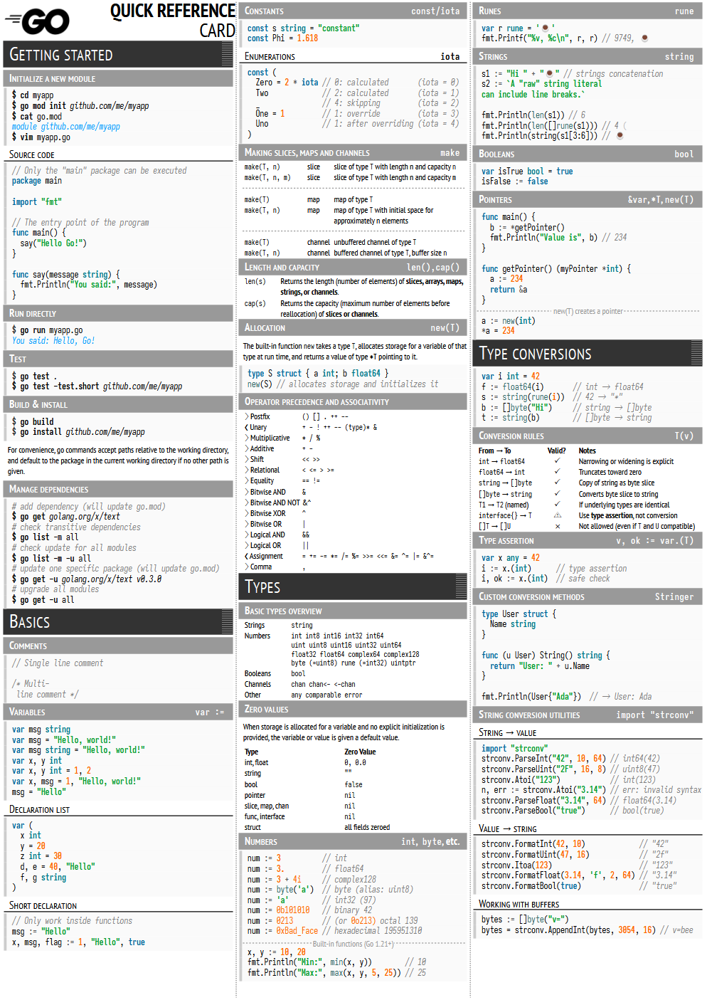
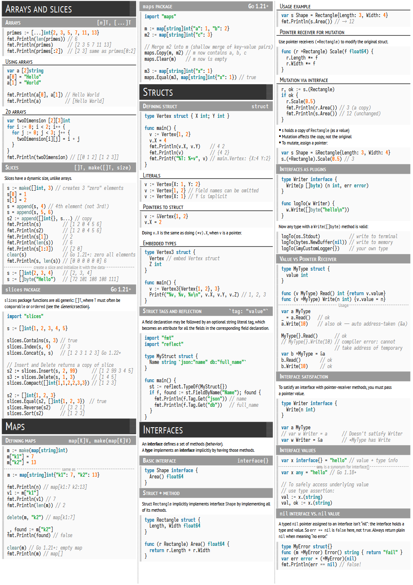
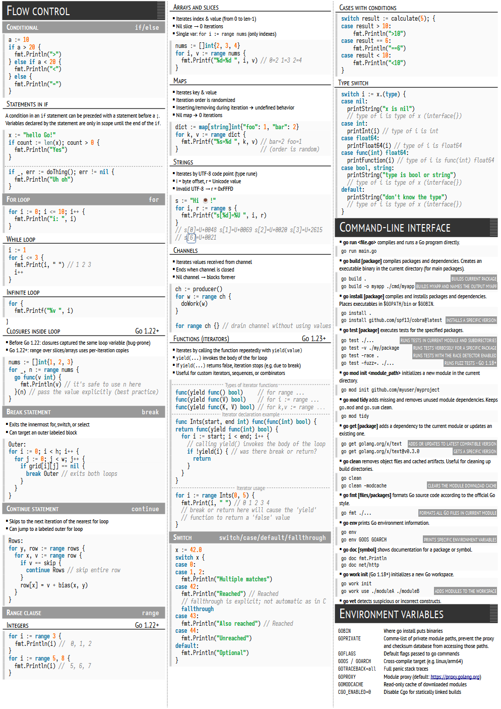

# RefCards

All RefCards are designed to be printed in A4 format. Please mind that page margins set to zero: when printing, remember to turn on scaling to the printer's real page margins.
## Go RefCard

Download: https://github.com/bytezoid/refcards/releases/tag/go-refcard-0.0.1
### Sample pages

  

### Sources
This Golang RefCard/Cheatsheet is based on and inspired by the following sources:

* https://quickref.me/go.html and https://devhints.io/go.html were the main source of the inspiration, overall structure and examples
* https://gosamples.dev provides (among other great things) a detailed reference on generics
* https://github.com/a8m/golang-cheat-sheet is a very detailed reference with tons of examples
* https://programming.guide/go/ was a source for concurrency and error handling sections, but of course it's not limited to those topics
* https://github.com/golang-standards/project-layout provides a good explanation on how to organize Go packages for your project
* https://golang.sk/images/blog/cheatsheets/go-cheat-sheet.pdf is a very compact 1-page Go cheat sheet
* https://hackr.io/blog/golang-cheat-sheet and https://zerotomastery.io/cheatsheets/golang-cheat-sheet/ are two another sources of good examples
* https://blog.jetbrains.com/go/2022/11/22/comprehensive-guide-to-testing-in-go/
* https://go.dev/ref/spec answered almost all other questions left :-)

Fonts used:
* Iosevka https://github.com/be5invis/Iosevka
* PT Sans https://www.paratype.com/fonts/pt/pt-sans
