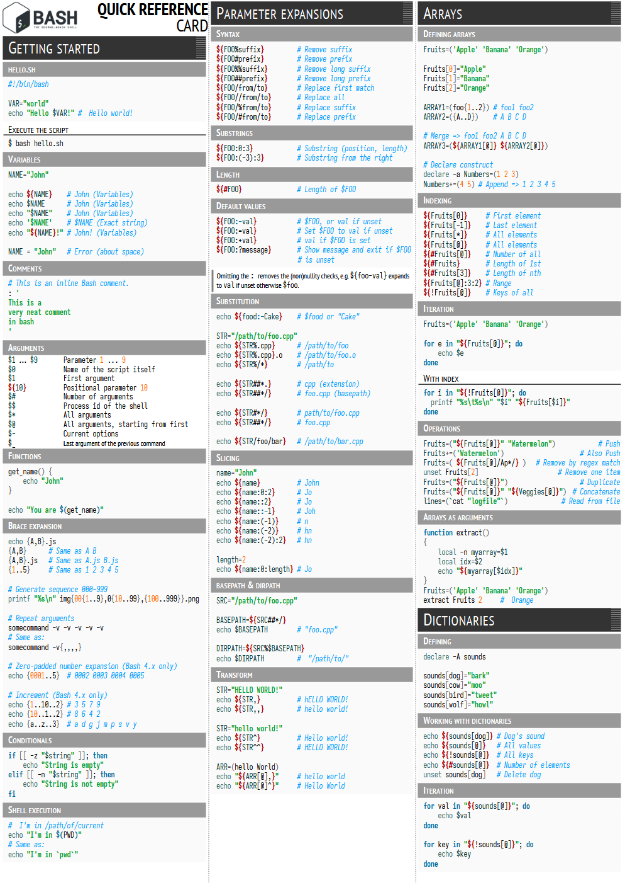

# RefCards

## How to print

All RefCards are designed to print in A4 format. Please note that the page margins are set to zero. When printing, remember to turn on scaling to fit the printer's actual page margins.

## Go RefCard

Download PDF: https://github.com/bytezoid/refcards/releases/download/go-refcard-2025-07-19/go-refcard-2025-07-19.pdf

### Sample pages

  

### Sources
This Golang RefCard/Cheatsheet is based on and inspired by the following sources:

* https://quickref.me/go.html and https://devhints.io/go.html were the main source of the inspiration, overall structure and examples
* https://gosamples.dev provides (among other great things) a detailed reference on generics
* https://github.com/a8m/golang-cheat-sheet is a very detailed reference with tons of examples
* https://programming.guide/go/ was a source for concurrency and error handling sections, but of course it's not limited to those topics
* https://github.com/golang-standards/project-layout provides a good explanation on how to organize Go packages for your project
* https://golang.sk/images/blog/cheatsheets/go-cheat-sheet.pdf is a very compact 1-page Go cheat sheet
* https://hackr.io/blog/golang-cheat-sheet and https://zerotomastery.io/cheatsheets/golang-cheat-sheet/ are two another sources of good examples
* https://blog.jetbrains.com/go/2022/11/22/comprehensive-guide-to-testing-in-go/
* https://go.dev/ref/spec answered almost all other questions left :-)

## Bash RefCard

Download PDF: https://github.com/bytezoid/refcards/releases/download/bash-refcard-0.0.1/bash-refcard.pdf

### Sample pages

  

### Sources

* https://devhints.io/bash.html and https://quickref.me/bash.html were again the main source of the inspiration
* https://gto76.github.io/linux-cheatsheet/ is a famous Comprehensive Linux Cheatsheet
* https://appletree.or.kr/quick_reference_cards/Unix-Linux/Bash%20Quick%20Reference.pdf is another exhaustive printable Linux cheatsheet
* https://devopedia.org/linux-signals a good article on Linux signals
* https://ss64.com/bash/syntax-keyboard.html contains many useful Bash keyboard shortcuts
* https://skorks.com/2009/09/bash-shortcuts-for-maximum-productivity/ has both useful shortcuts and tips on working with Bash history
* https://github.com/fliptheweb/bash-shortcuts-cheat-sheet and https://clementc.github.io/blog/2018/01/25/moving_cli/ contain a nice diagram depicting cursor movement shortcuts

# Credits

## Software

* Cheatsheets were designed in the [LibreOffice Writer](https://www.libreoffice.org/discover/writer/)
* For the code highlighting the brilliant [Code Highlighter 2](https://extensions.libreoffice.org/en/extensions/show/5814) extension was used.

## Fonts

* Iosevka https://github.com/be5invis/Iosevka is a beautiful monospace font with a lot of different variations.
* PT Sans https://www.paratype.com/fonts/pt/pt-sans is a great free alternative to the Myriad Pro font.
